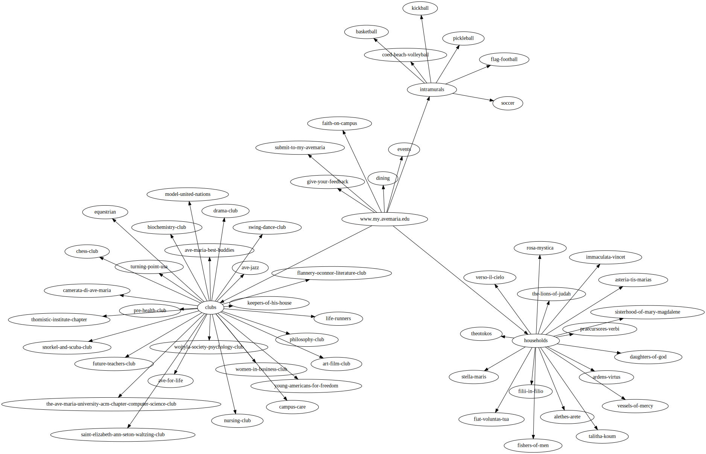
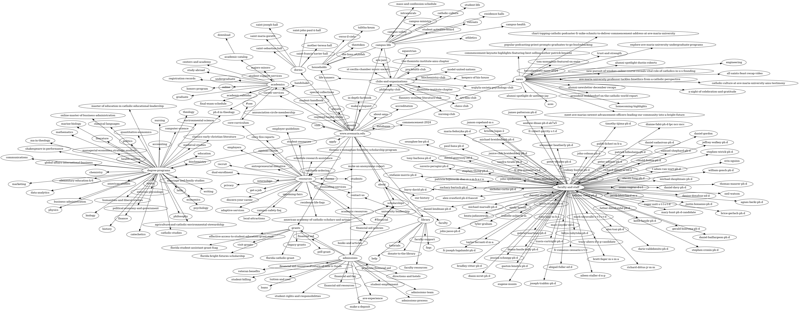

# sitemap
sitemap is a small project that helps visualize website layouts.
The program scans a specified website and follows all links under the same domain using a DFS. 
After organizing the results, the program outputs a dot file which can be modified and then compiled.
the default url is set to my univeristy, which gives a fairly complex result.

```
./sitemap -url="https://www.avemaria.edu"
```

To avoid potential bugs, include "https://www" when you specify a url.
Because different sites often link back to the home page, there is the danger of infinite loops. use `-depth` to adjust the throroughness of the DFS seach (default 10).
Use `-v` to get a hierarchical print of all the pages and their children.


You will need to install dot in order to build the output.

```
dot -Tpdf sitemap.dot -o output.pdf
```

If the output will not compile, you may need to adjust some of the attributes in dot. It probably won't look to good when you render the first time.
You have full customizability.

I enjoyed learning about the go programming languages and practicing some more complex algorithim and data structure concepts.

## Example

```./sitemap -url="https://www.my.avemaria.edu"```



```./sitemap -url="https://www.avemaria.edu" -depth=10```



## Fixes

There are many things that need to be fixed, including a more powerful GET request function that handles exceptions and frameworks that obfuscate the DOM and accounting for things like subdomains.
